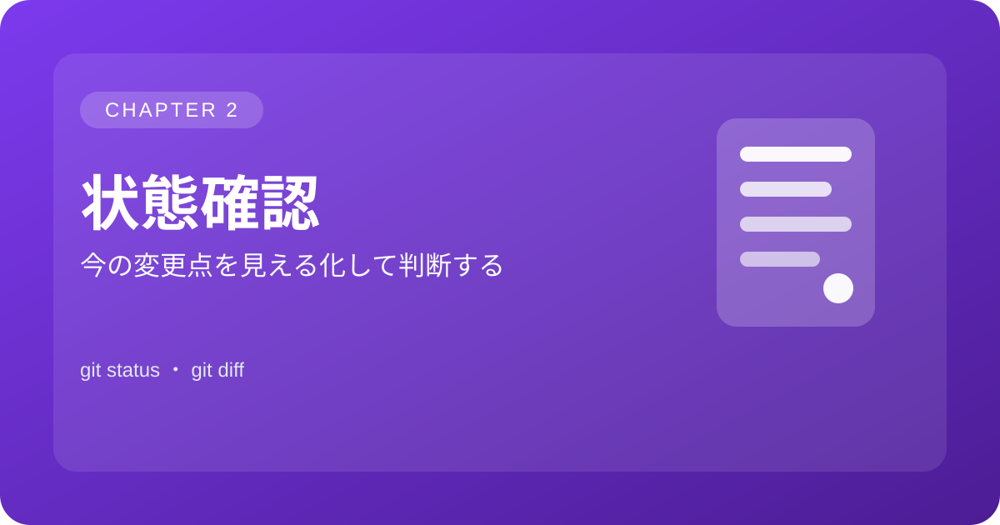

<p align="center">
  
</p>

# 2. 状態確認

> この章では「変更内容と未追跡ファイルを確認する」ための基本操作を学びます。

| 項目 | 内容 |
| --- | --- |
| 作業 | 変更内容と未追跡ファイルを確認する |
| 目的 | 次に何を追加・コミットするか判断する |

## コマンド例

```bash
git status
git diff
```

## ポイント

作業の節目で状態確認を行うと、意図しない変更を早めに見つけやすくなります。

[← マニュアルの目次に戻る](gitmanual.md)
