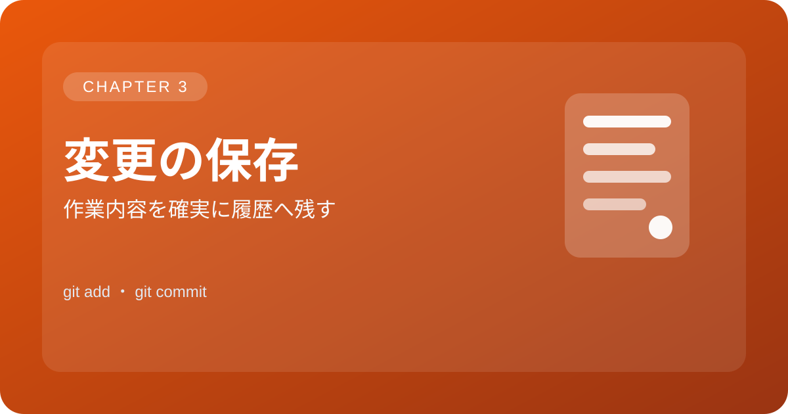

<p align="center">
  
</p>

# 3. 変更の保存

> この章では「変更をインデックスに追加し、履歴に残す」ための基本操作を学びます。

| 項目 | 内容 |
| --- | --- |
| 作業 | 変更をインデックスに追加し、履歴に残す |
| 目的 | 変更を確定して、後で見返せるようにする |

## コマンド例

```bash
git add .
git commit -m "初回コミット"
```

## ポイント

コミットメッセージは後から読み返しやすいように、作業内容が伝わる短い文にすると便利です。

[← マニュアルの目次に戻る](gitmanual.md)
